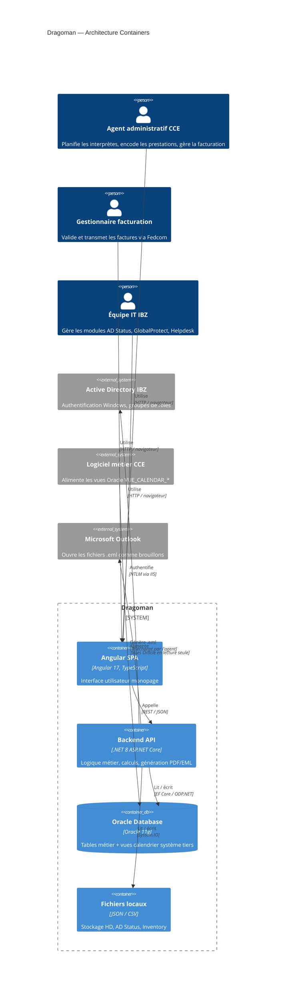
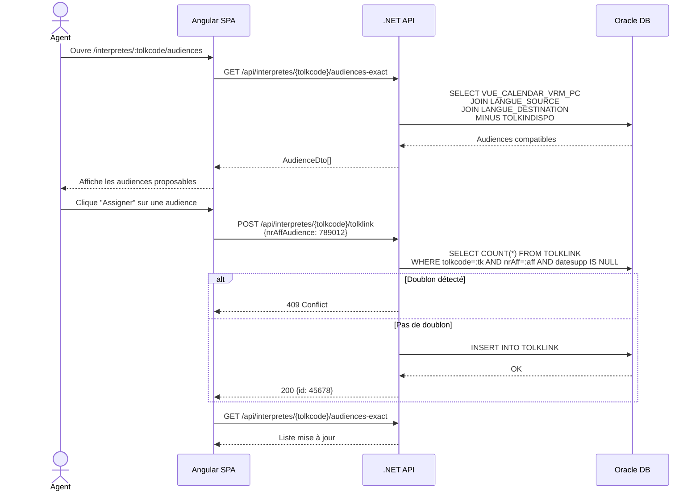
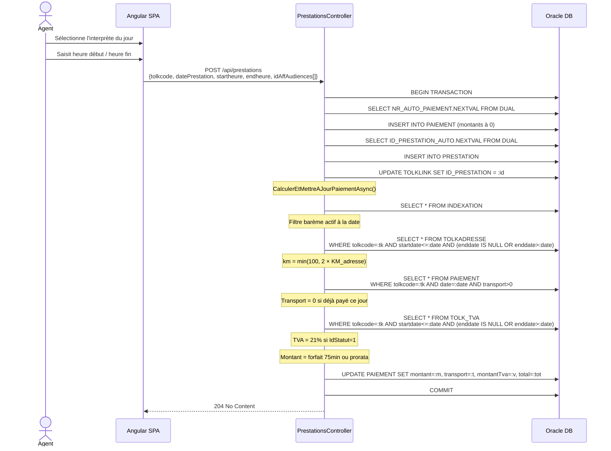
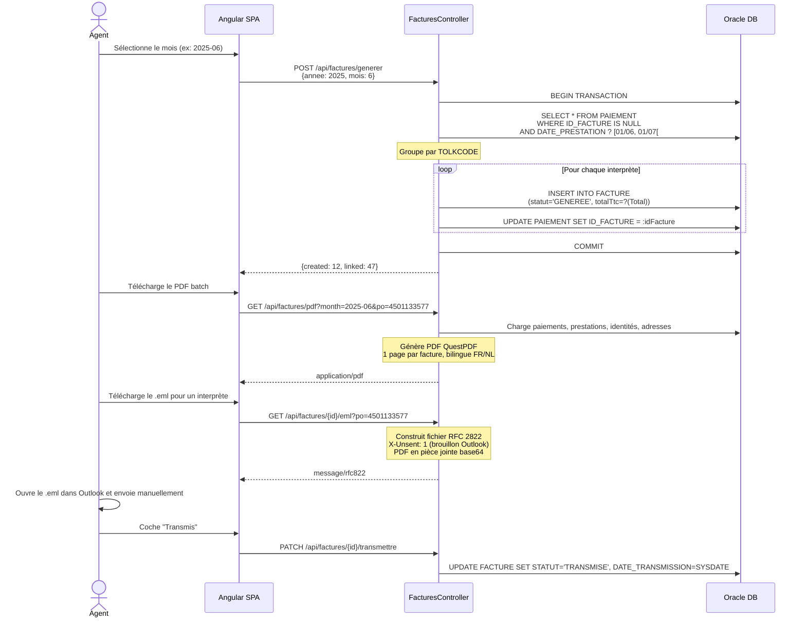
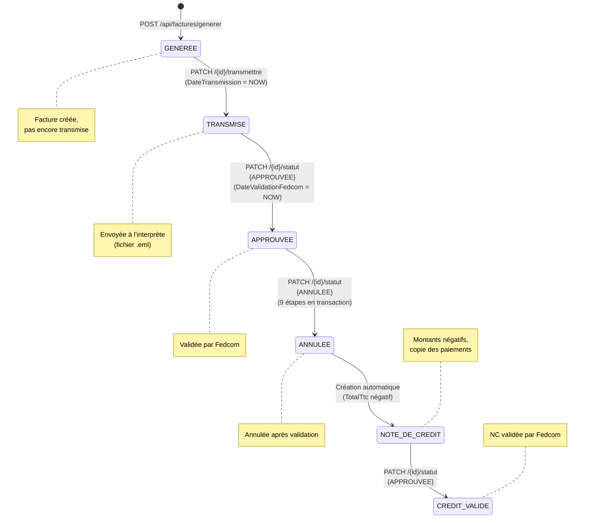
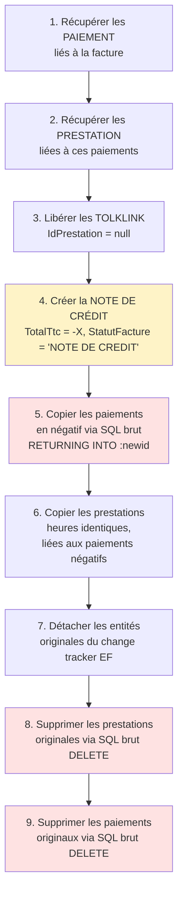
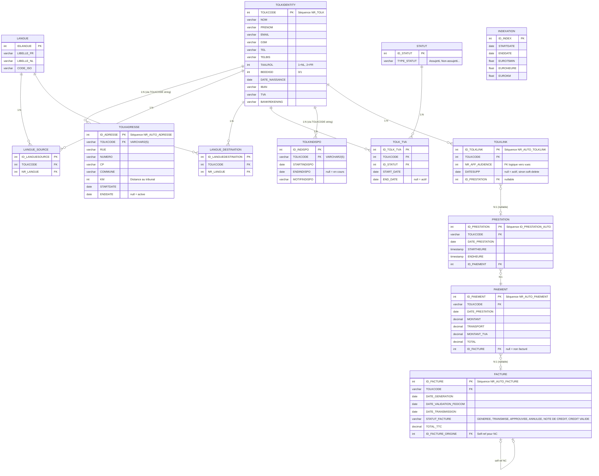

# Dragoman — Analyse fonctionnelle et technique complète

> **Version** : 1.0 — Juillet 2025
> **Audience** : Développeurs, équipe métier, maintenance, auditeurs
> **Objectif** : Document auto-suffisant couvrant l'ensemble des fonctionnalités, règles métier, architecture, processus, et points de vigilance de l'application Dragoman.

---

## Table des matières

1. [Contexte et objectif](#1-contexte-et-objectif)
2. [Architecture globale](#2-architecture-globale)
3. [Processus de bout en bout](#3-processus-de-bout-en-bout)
4. [Règles métier avancées](#4-règles-métier-avancées)
5. [Workflow complet des factures](#5-workflow-complet-des-factures)
6. [Gestion des indisponibilités](#6-gestion-des-indisponibilités)
7. [Validation des données](#7-validation-des-données)
8. [Modules fonctionnels](#8-modules-fonctionnels)
9. [Rôles utilisateur](#9-rôles-utilisateur)
10. [Contraintes techniques et infrastructure](#10-contraintes-techniques-et-infrastructure)
11. [Base de données Oracle — Modèle de données](#11-base-de-données-oracle--modèle-de-données)
12. [Intégrations et données externes](#12-intégrations-et-données-externes)
13. [Aspects non fonctionnels et exploitation](#13-aspects-non-fonctionnels-et-exploitation)
14. [Points de vigilance — Ce que les diagrammes ne montrent pas](#14-points-de-vigilance--ce-que-les-diagrammes-ne-montrent-pas)
15. [Annexes — Constantes métier et référentiels](#15-annexes--constantes-métier-et-référentiels)

---

## 1. Contexte et objectif

### 1.1 Organisme

Le **Conseil du Contentieux des Étrangers** (CCE / RvV — *Raad voor Vreemdelingenbetwistingen*) est une juridiction administrative fédérale belge rattachée au **SPF Intérieur (IBZ)**. Elle traite les recours en matière de droit des étrangers.

Pour instruire ses affaires, le CCE recourt à des **interprètes judiciaires freelances** (assermentés ou non) qui assurent la traduction entre le magistrat (en français ou en néerlandais) et la partie étrangère lors des audiences.

### 1.2 Problème résolu

Avant Dragoman, la gestion des interprètes reposait sur des processus manuels (tableurs, emails, documents Word) avec les risques associés : erreurs de double assignation, délais de paiement, absence de traçabilité. Dragoman centralise et automatise l'intégralité du cycle de vie.

### 1.3 Périmètre

Dragoman est une **application web interne** à usage exclusif des agents administratifs du CCE (pas d'accès interprètes). Elle couvre :

| Domaine | Fonctionnalités |
|---|---|
| Gestion des interprètes | Fiche identité, langues, adresses historisées, statuts TVA, indisponibilités |
| Planification | Calendrier des audiences, assignation, présence journalière, convocations |
| Facturation | Encodage des prestations, calcul automatique, génération de factures, transmission email |
| Modules IT | Helpdesk (HD), inventaire GlobalProtect, surveillance Active Directory |

---

## 2. Architecture globale

### 2.1 Stack technologique

| Couche | Technologie | Version |
|---|---|---|
| Frontend | Angular (SPA) | 17 |
| Backend | ASP.NET Core Web API | .NET 8 |
| Base de données | Oracle Database (via EF Core + ODP.NET) | 11g |
| PDF | QuestPDF | Community |
| Excel | ClosedXML | — |
| Word | DocumentFormat.OpenXml (OOXML SDK) | — |
| Serveur web | IIS (in-process) | — |
| Authentification | Windows Authentication (NTLM/Negotiate) via IIS | — |

### 2.2 Diagramme d'architecture C4 — Niveau 2 (Containers)



### 2.3 Architecture backend

L'API adopte une architecture **Controller-only** :
- Pas de couche Service / Business Logic Layer
- Pas de couche Repository (accès direct au `ApplicationDbContext`)
- 19 fichiers contrôleur, 20 classes contrôleur, ~72 endpoints
- Les contrôleurs les plus volumineux (`FacturesController`, `ReportsController`) dépassent 600 lignes

### 2.4 Architecture frontend

Architecture **monolithique modulaire** sans state management centralisé (pas de NgRx/Akita). Tous les composants sont déclarés dans un unique `AppModule`, sauf 2 composants standalone lazy-loaded (HD).

---

## 3. Processus de bout en bout

### 3.1 Cycle complet — Vision globale

```mermaid
flowchart LR
    A[??? Audience<br>programmée<br><i>système tiers CCE</i>] --> B[?? Recherche<br>interprète<br>compatible]
    B --> C[?? Assignation<br>interprète ? audience]
    C --> D[?? Convocation<br><i>email bilingue</i>]
    D --> E[? Présence<br>journalière]
    E --> F[?? Prestation<br>encodée<br><i>heures début/fin</i>]
    F --> G[?? Calcul<br>automatique<br><i>montant, transport,<br>TVA</i>]
    G --> H[?? Regroupement<br>mensuel<br><i>par interprète</i>]
    H --> I[?? Génération<br>facture]
    I --> J[?? PDF<br>+ .eml]
    J --> K[?? Transmission<br><i>via Outlook</i>]
    K --> L[? Validation<br>Fedcom]

    style A fill:#e0f2fe
    style I fill:#fef3c7
    style L fill:#d1fae5
```



### 3.2 Diagramme de séquence — Assignation d'un interprète



### 3.3 Diagramme de séquence — Encodage d'une prestation et calcul du paiement



### 3.4 Diagramme de séquence — Génération de factures



---

## 4. Règles métier avancées

### 4.1 Calcul automatique des paiements

Le calcul est déclenché automatiquement à chaque création de prestation (`POST /api/prestations`).

#### Pipeline de calcul

```
Entrées :
  ?? Prestation (Startheure, Endheure, DatePrestation, Tolkcode)
  ?? Table INDEXATION (barème actif à la date)
  ?? Table TOLKADRESSE (km de l'adresse active à la date)
  ?? Table TOLK_TVA (statut TVA actif à la date)

Sorties (écrites dans PAIEMENT) :
  ?? Montant     ? prestation HT
  ?? Transport   ? frais de déplacement HT
  ?? MontantTva  ? TVA sur (Montant + Transport)
  ?? Total       ? Montant + Transport + MontantTva
```

#### Étape 1 — Résolution du barème d'indexation

Le barème applicable est celui valide à la **date de prestation** (pas la date de saisie) :

```
DatePrestation ? [STARTDATE, ENDDATE[
```

Si `ENDDATE == null` ? barème actif courant. Si aucun barème trouvé ? erreur 500.

Variables extraites : `EURO75MIN`, `EUROHEURE`, `EUROKM`.

#### Étape 2 — Calcul de la durée

```
Durée brute = Endheure - Startheure (en minutes)
Durée arrondie = ?Durée brute / 15? × 15   (quart d'heure supérieur)
```

| Durée brute | Arrondi |
|---|---|
| 47 min | 60 min |
| 60 min | 60 min |
| 61 min | 75 min |
| 76 min | 90 min |

#### Étape 3 — Calcul du montant prestation

**Règle du minimum 75 minutes** :

```
Si durée ? 75 min ? montant = EURO75MIN (forfait fixe)
Si durée > 75 min ? montant = EURO75MIN + (durée - 75) × (EUROHEURE / 60)
```

| Durée arrondie | Calcul (EURO75MIN=31.52, EUROHEURE=25.21) | Montant |
|---|---|---|
| 15 min | 31.52 | 31.52 € |
| 75 min | 31.52 | 31.52 € |
| 90 min | 31.52 + 15 × (25.21/60) | 37.83 € |
| 120 min | 31.52 + 45 × (25.21/60) | 50.41 € |

#### Étape 4 — Calcul du transport

```
KM aller-retour = min(100, 2 × KM_adresse)
Transport = EUROKM × KM_aller_retour
```

| KM saisi | KM A/R calculé | Plafond appliqué |
|---|---|---|
| 20 | 40 | Non |
| 50 | 100 | Oui (= plafond) |
| 80 | 100 | Oui |

**Adresse sélectionnée** : celle dont `Startdate ? date < Enddate` (ou `Enddate == null`), triée par `Startdate DESC`. Si aucune adresse ? KM = 0 ? transport = 0.

**Règle du transport unique par jour** : si un paiement avec `Transport > 0` existe déjà pour le même interprète le même jour ? transport = 0 pour la prestation courante.

#### Étape 5 — TVA

```
Si TOLK_TVA.IdStatut == 1 (assujetti) à la date de prestation :
    TVA = arrondi?((Montant + Transport) × 0.21)
Sinon :
    TVA = 0

Total = Montant + Transport + TVA
```

Taux TVA : constante `0.21m` codée en dur (`PrestationsController.TVA_RATE`).

### 4.2 Indexation des tarifs

La table `INDEXATION` contient les barèmes tarifaires historisés :

| Champ | Signification |
|---|---|
| `EURO75MIN` | Montant forfaitaire pour toute prestation ? 75 minutes |
| `EUROHEURE` | Tarif horaire au-delà des 75 minutes (proratisé à la minute) |
| `EUROKM` | Tarif par kilomètre de déplacement |
| `STARTDATE` / `ENDDATE` | Période de validité (`null` = barème courant) |

La table est en **lecture seule** — jamais modifiée par l'application. Les barèmes sont gérés directement en base par un administrateur.

?? **Point de vigilance** : toutes les lignes d'indexation sont chargées en mémoire à chaque calcul de prestation (`ToListAsync()`), puis filtrées côté C#. Pas de filtre SQL.

### 4.3 Historisation des adresses et statuts TVA

Les adresses et statuts TVA sont historisés avec des périodes `[Startdate, Enddate[` :

- **Adresses** : lors d'un remplacement (`POST /replace`), l'adresse active (`Enddate == null`) est clôturée automatiquement (`Enddate = nouvelle.Startdate - 1 jour`), et la nouvelle est créée avec `Enddate = null`.
- **Statuts TVA** : même principe — l'ajout d'un nouveau statut (`POST /tva`) clôture l'ancien.

Le champ `KM` de l'adresse active à la date de prestation détermine le montant du transport. Si l'adresse change en cours de mois, les prestations avant utilisent l'ancien KM, celles après utilisent le nouveau.

---

## 5. Workflow complet des factures

### 5.1 Diagramme d'états



### 5.2 Transitions autorisées et interdites

| Depuis | Vers | Autorisé | Condition |
|---|---|---|---|
| `GENEREE` | `TRANSMISE` | ? | Via PATCH transmettre |
| `GENEREE` | `APPROUVEE` | ? | Doit d'abord être transmise |
| `TRANSMISE` | `APPROUVEE` | ? | `DateValidationFedcom = NOW` |
| `APPROUVEE` | `ANNULEE` | ? | Déclenche les 9 étapes |
| `NOTE DE CREDIT` | `CREDIT VALIDE` | ? | Approbation d'une NC |
| `NOTE DE CREDIT` | `ANNULEE` | ? | Impossible d'annuler une NC |
| `CREDIT VALIDE` | `ANNULEE` | ? | Impossible d'annuler une NC |

### 5.3 Processus d'annulation — 9 étapes en transaction

L'annulation d'une facture `APPROUVEE` est le processus le plus complexe du système :



**Résultat final en base après annulation** :

| Entité | État |
|---|---|
| Facture originale | `StatutFacture = "ANNULEE"`, `TotalTtc = +X` |
| Facture crédit | `StatutFacture = "NOTE DE CREDIT"`, `TotalTtc = -X`, `IdFactureOrigine = id_originale` |
| Paiements originaux | **Supprimés** physiquement |
| Paiements crédit | Montants négatifs, liés à la facture crédit |
| Prestations originales | **Supprimées** physiquement |
| Prestations crédit | Mêmes heures, liées aux paiements crédit |
| TOLKLINK | `IdPrestation = null` (audiences libérées) |

### 5.4 Génération PDF de facture

Chaque facture génère un PDF A4 contenant :

| Section | Contenu |
|---|---|
| Titre | `FACTUUR` / `FACTURE` (ou `CREDITNOTA` / `NOTE DE CRÉDIT` en rouge) |
| Références | Ref `RVV-CCE/{id}`, N° entreprise `0308356862`, PO |
| Fournisseur | Nom, adresse (Rue + N° + Bte, CP + Commune) |
| Client | Account Payable IBZ (bilingue FR/NL) |
| Bloc TVA/Bank | N° TVA, Kenmerk (=tolkcode), BBAN formaté `xxx-xxxxxxx-xx`, Fedcom |
| Tableau | Date, Début, Fin, Durée, Km, € prestation, € déplacement |
| Totaux | Total prestation HT, Total déplacement HT, Total HT, TVA 21% (si applicable), Total TTC |
| Signature | "Date et signature" / "Datum en handtekening" |

**Bilingue** : la langue est déterminée par `TOLKIDENTITY.TAALROL` :
- `TAALROL == 1` ? NL (Néerlandais)
- `TAALROL == 2` (ou tout autre valeur, y compris null) ? FR (Français)

### 5.5 Transmission par email (.eml)

Le fichier `.eml` (RFC 2822) contient :
- **Header `X-Unsent: 1`** : Outlook ouvre le fichier comme brouillon (non envoyé)
- **To** : email de l'interprète
- **Subject** : bilingue FR/NL selon `TAALROL`
- **Body** : texte de courtoisie + notice Peppol trilingue (FR/NL/EN) annonçant l'obligation e-facturation 2026
- **Pièce jointe** : PDF de la facture en base64

L'agent télécharge le `.eml`, l'ouvre dans Outlook, et l'envoie manuellement. La date de transmission est ensuite marquée en base.

---

## 6. Gestion des indisponibilités

### 6.1 Modèle

Chaque indisponibilité est une période `[Startindispo, Endindispo]` stockée dans `TOLKINDISPO`. Si `Endindispo == null`, l'indisponibilité est en cours (période ouverte).

### 6.2 Anti-chevauchement

À l'ajout d'une nouvelle indisponibilité, le contrôleur charge **toutes** les périodes existantes en mémoire et vérifie qu'il n'y a pas de chevauchement :

```
Chevauchement si : start < existingEnd AND end > existingStart
```

Si chevauchement détecté ? `409 Conflict`.

### 6.3 Clôture automatique

Si une période ouverte (`Endindispo == null`) existe déjà, elle est automatiquement clôturée :

```
Endindispo = nouveau.Startindispo - 1 jour
```

### 6.4 Impact sur l'assignation

Les indisponibilités sont prises en compte lors de la recherche d'interprètes compatibles (`GET /audiences-exact` et `GET /match`). Un interprète indisponible à une date d'audience est exclu des résultats.

---

## 7. Validation des données

### 7.1 Téléphone belge

À la création d'un interprète, les numéros de téléphone sont validés :

```
Format accepté : +32XXXXXXXXX ou 0XXXXXXXXX
Nettoyage : suppression espaces, points, tirets, slashes
Validation : 9 à 12 chiffres après nettoyage
```

Côté frontend, la classification GSM/fixe est automatique :
- Commence par `04`, `+324`, `324` ? GSM
- Sinon ? fixe

### 7.2 TVA belge

```
Format : BE + 10 chiffres
Nettoyage : suppression espaces et points, conversion en UPPER
Exemple valide : BE0123456789
```

### 7.3 IBAN

Pas de validation formelle côté serveur, uniquement une longueur maximale de 34 caractères. Le BBAN belge est formaté à l'affichage dans le PDF (`xxx-xxxxxxx-xx`).

### 7.4 Normalisation du nom

Le nom est converti en `UPPER` et `Trim()` à la création.

### 7.5 Normalisation Taalrol et Beedigd

| Champ | Valeurs valides | Sinon |
|---|---|---|
| `Taalrol` | 1 (NL) ou 2 (FR) | `null` |
| `Beedigd` | 1 (assermenté) | 0 |

---

## 8. Modules fonctionnels

### 8.1 Module Interprètes

Fiche identité en 6 sections accordéon (Identité, Contact, Langue & Statut, Banque & TVA, Entreprise, Divers). Sous-pages : Adresses, TVA/Statut, Langues, Indisponibilités, Audiences compatibles, Convocation.

### 8.2 Module Calendrier

Vue globale des audiences (union des vues Oracle VRM + ANN). Filtres multi-critères réactifs (`combineLatest` + `BehaviorSubject`). Modal d'assignation directe. **Toutes les données sont chargées en mémoire côté client** (pas de pagination serveur).

### 8.3 Module Présence journalière

Vue synthétique des interprètes assignés pour un jour. Statuts : avec prestation / sans prestation / absent. Marquage absence, remplacement d'interprète. **Export tri-format** : Excel (ClosedXML), Word (OOXML SDK, 1 page par audience + synthèse), PDF (QuestPDF, A4 paysage).

### 8.4 Module Prestations

Encodage des heures de début/fin. Pré-remplissage automatique de l'heure suggérée (heure d'audience ? 15 min). Calcul automatique à la validation.

### 8.5 Module Facturation

3 onglets : **Générer** (par mois ou période libre), **Enregistrer** (approbation, annulation, transmission .eml), **Historique** (filtrage par mois, statut, tolkcode).

### 8.6 Module Convocation

Génération d'un email HTML bilingue FR/NL pour un interprète. Combine audiences confirmées + audiences disponibles sélectionnées. Copie presse-papier via `ClipboardItem` API (fallback `execCommand`). Ouverture client mail via `mailto:`.

### 8.7 Module Helpdesk (HD)

Gestion des tickets et tâches journalières pour les agents IT. **Stockage JSON sur le serveur** (pas de base de données). Fichiers organisés par utilisateur et semaine ISO. Export Word hebdomadaire avec tableau récapitulatif et détail par jour.

### 8.8 Module Inventaire GlobalProtect

Suivi des machines avec client VPN Palo Alto. Import CSV PowerShell avec merge (préserve les annotations manuelles). Filtres : texte global, localisation, version exacte, vérifié/non. Stats calculées côté client. Export CSV avec BOM UTF-8.

### 8.9 Module AD Status

Surveillance des comptes Active Directory. Alimenté par un CSV PowerShell (`AD_Users.csv`). 5 catégories d'alertes (expiré, bientôt expiré ×3 seuils, inactif 90j+). Commentaires et flag « normal » persistés en JSON. **Seul module avec contrôle d'accès rôle AD** (`gg_rol_SystemAdministrator`).

---

## 9. Rôles utilisateur

### 9.1 Rôles métier (implicites)

L'application ne gère pas les rôles au niveau applicatif (sauf AD Status). Les rôles sont des profils d'usage :

| Rôle | Responsabilités | Modules utilisés |
|---|---|---|
| **Agent administratif** | Planification des interprètes : recherche, assignation, présence, encodage prestations, convocations | Interprètes, Calendrier, Présence, Prestations, Convocation |
| **Gestionnaire facturation** | Génération, approbation, transmission et suivi des factures | Paiements, Factures, Génération factures |
| **Équipe IT IBZ** | Suivi des tickets HD, inventaire machines, surveillance AD | HD, GlobalProtect, AD Status |

### 9.2 Contrôle d'accès technique

| Niveau | Mécanisme | Couverture |
|---|---|---|
| Réseau | Intranet IBZ uniquement | Tous les modules |
| IIS | Windows Authentication (NTLM/Negotiate) | Tous les endpoints |
| Applicatif `[Authorize]` | `AuthController.WhoAmI()` (1 endpoint) | Authentification de base |
| Applicatif `[Authorize(Roles)]` | `AdStatusController` (toute la classe) | AD Status uniquement |
| **18 contrôleurs** | **Aucune autorisation applicative** | Protégés uniquement par IIS |

---

## 10. Contraintes techniques et infrastructure

### 10.1 Authentification Windows (NTLM)

L'authentification repose sur IIS et Active Directory IBZ :
- `GET /api/auth/whoami` déclenche le handshake NTLM et retourne `DOMAIN\username`
- L'en-tête `X-Remote-User` est injecté par le proxy Apache (si présent dans la chaîne)
- Un `CredentialsInterceptor` Angular ajoute `withCredentials: true` sur les requêtes vers `/api/`

### 10.2 Dépendance aux vues Oracle (lecture seule)

Les vues suivantes sont produites par le **logiciel métier tiers du CCE** et sont en lecture seule pour Dragoman :

| Vue | Entité EF Core | Usage |
|---|---|---|
| `VUE_CALENDAR_VRM_PC` | `VueCalendarVrmPc` | Calendrier des audiences VRM/PCS |
| `VUE_CALENDAR_ANN` | `VueCalendarAnn` | Calendrier des annulations |
| `V_AUDIENCE_INTERPRETE_DETAIL` | `VAudienceInterpreteDetail` | Rapports de présence détaillés |

?? **Point critique** : si ces vues changent de structure ou deviennent indisponibles, une grande partie de Dragoman cesse de fonctionner (calendrier, assignation, prestations, rapports).

### 10.3 Séquences Oracle pour la génération des IDs

| Séquence | Tables | Stratégie |
|---|---|---|
| `NR_TOLK` | `TOLKIDENTITY` | SQL brut inline |
| `NR_AUTO_PAIEMENT` | `PAIEMENT` | `HasDefaultValueSql` + SQL brut (double) |
| `ID_PRESTATION_AUTO` | `PRESTATION` | `HasDefaultValueSql` + SQL brut (double) |
| `NR_AUTO_FACTURE` | `FACTURE` | `HasDefaultValueSql` |
| `NR_AUTO_TOLKLINK` | `TOLKLINK` | `HasDefaultValueSql` |
| `NR_AUTO_ADRESSE` | `TOLKADRESSE` | SQL brut (`NextIdAdresseAsync`) |
| `NR_AUTO_LANGUE_SOURCE` | `LANGUE_SOURCE` | SQL brut (`GetNextValAsync`) |
| `NR_AUTO_DESTINATION` | `LANGUE_DESTINATION` | SQL brut (`GetNextValAsync`) |

?? La logique `SELECT {sequence}.NEXTVAL FROM DUAL` est dupliquée dans **4 méthodes privées distinctes** réparties dans 4 contrôleurs différents — pas d'abstraction partagée.

### 10.4 Déploiement IIS

| Paramètre | Valeur |
|---|---|
| Mode | In-process |
| Serveur | `rvv-ccesrv21` (intranet IBZ) |
| Authentification | Windows Authentication activée au niveau IIS |
| CORS | `http://localhost:4200` (dev) + `http://rvv-ccesrv21` (prod) |
| HTTPS | ? Non — HTTP uniquement (credentials NTLM en clair sur le réseau local) |

### 10.5 CORS

```csharp
policy.WithOrigins("http://localhost:4200", "http://rvv-ccesrv21")
      .AllowAnyHeader()
      .AllowAnyMethod()
      .AllowCredentials();
```

---

## 11. Base de données Oracle — Modèle de données

### 11.1 Schéma entité-relation (ERD)



### 11.2 Incohérence de typage TOLKCODE

La colonne `TOLKCODE` est la clé métier centrale mais son type varie :

| Table | Type Oracle | Type C# |
|---|---|---|
| `TOLKIDENTITY` | `NUMBER` | `int` |
| `TOLKADRESSE` | `VARCHAR2(5)` | `string` |
| `TOLKINDISPO` | `VARCHAR2(5)` | `string` |
| `TOLKLINK` | `NUMBER` | `int` |
| `PRESTATION` | `VARCHAR2` | `string` |
| `PAIEMENT` | `VARCHAR2` | `string` |
| `FACTURE` | `VARCHAR2` | `string` |

**Conséquences** : conversions `tolkcode.ToString()` et `int.TryParse()` omniprésentes, jointures EF Core impossibles, risque `ORA-01722`.

---

## 12. Intégrations et données externes

### 12.1 Base Oracle — Tables métier

Toutes les tables métier (TOLKIDENTITY, TOLKLINK, PRESTATION, PAIEMENT, FACTURE, etc.) sont dans le schéma `DRAGOMAN` de la base Oracle (`LAURENTIDE` en dev, `CCE11g` en prod).

### 12.2 Vues Oracle — Système tiers

Les vues `VUE_CALENDAR_VRM_PC`, `VUE_CALENDAR_ANN` et `V_AUDIENCE_INTERPRETE_DETAIL` sont alimentées par le logiciel métier du CCE. Dragoman les lit en lecture seule. **Pas de FK physique** entre `TOLKLINK.NR_AFF_AUDIENCE` et ces vues.

### 12.3 Fichiers plats

| Fichier | Module | Format | Localisation |
|---|---|---|---|
| `{user}/{semaineISO}/{user}_{semaineISO}_{date}.json` | Helpdesk | JSON | `data/hd-prestations/` |
| `GlobalProtectInventory.json` | Inventaire | JSON | `Data/` |
| `adstatus_persistence.json` | AD Status | JSON | `D:\Dragoman\Data\` |
| `AD_Users.csv` | AD Status | CSV `;` | `D:\Dragoman\Data\` (configurable) |

### 12.4 Email — Fichiers .eml

La génération de fichiers `.eml` (RFC 2822 MIME) permet de créer des brouillons Outlook avec le PDF en pièce jointe. **Il n'y a pas d'envoi automatisé** — l'agent télécharge le fichier et l'envoie manuellement.

---

## 13. Aspects non fonctionnels et exploitation

### 13.1 Logs

| Source | Type | Accès |
|---|---|---|
| IIS | Fichiers logs IIS (accès HTTP, erreurs 500) | Serveur `rvv-ccesrv21` |
| Console navigateur | Erreurs Angular (`console.error`) | DevTools navigateur |
| Kestrel (dev) | Sortie console .NET | Terminal Visual Studio |

?? Pas de middleware de gestion d'erreurs global (`UseExceptionHandler`, `ProblemDetails`). Les erreurs 500 retournent une stack trace en dev et un message vide en prod.

### 13.2 Maintenance

| Fréquence | Actions |
|---|---|
| **Quotidienne** | Vérifier les vues Oracle (stabilité), contrôler les audiences du jour sur le dashboard |
| **Hebdomadaire** | Export Word des fiches HD, vérification des comptes AD (module AD Status) |
| **Mensuelle** | Génération des factures, approbation Fedcom, transmission .eml, archivage PDF |
| **Ponctuelle** | Import CSV GlobalProtect/AD, mise à jour des barèmes INDEXATION (par DBA), rotation des mots de passe Oracle |

### 13.3 Sécurité

| Aspect | État | Risque |
|---|---|---|
| Authentification réseau | Windows Auth (NTLM) via IIS | ?? HTTP uniquement (pas HTTPS) |
| Autorisation applicative | 2/20 contrôleurs protégés | ?? Absence de défense en profondeur |
| Secrets en clair | `appsettings*.json` dans Git (repo GitHub public) | ?? Critique — mots de passe Oracle exposés |
| CORS | Origines restreintes, `AllowAnyHeader/Method` | ?? Permissif |
| SQL injection | Interpolation de chaîne dans `ExecuteSqlRawAsync` | ?? Risque faible (valeurs int) |
| Race conditions | Génération factures en double, transport compté 2× | ?? Moyenne |

### 13.4 Codes HTTP utilisés

| Code | Usage |
|---|---|
| `200 OK` | Succès avec corps de réponse |
| `201 Created` | Création réussie (avec header `Location`) |
| `204 No Content` | Mise à jour / suppression réussie |
| `400 Bad Request` | Validation échouée, paramètres manquants |
| `401 Unauthorized` | Handshake NTLM non complété |
| `404 Not Found` | Entité inexistante |
| `409 Conflict` | Doublon (assignation, indisponibilité chevauchante) |
| `500 Internal Server Error` | Exception non gérée (barème manquant, erreur Oracle) |

---

## 14. Points de vigilance — Ce que les diagrammes ne montrent pas

### 14.1 Gestion des erreurs

Pas de middleware global d'erreurs. Les exceptions non gérées (barème d'indexation manquant, connexion Oracle perdue, verrou) retournent un HTTP 500 silencieux. Pas de pattern `ProblemDetails` (RFC 7807).

### 14.2 Contrôles de cohérence

| Contrôle | Implémenté | Mécanisme |
|---|---|---|
| Doublon assignation TOLKLINK | ? | `COUNT` avant insertion (pas de verrou ? race condition possible) |
| Chevauchement indisponibilités | ? | Vérification en mémoire (toutes les périodes chargées) |
| Double facturation | ? | Filtre `IdFacture IS NULL` sur les paiements |
| Transport 1×/jour | ? | Vérification en mémoire (pas de verrou ? race condition possible) |
| Doublon langue source/destination | ? | Vérification avant insertion (409 Conflict) |
| Facture non transmise avant approbation | ? | Vérification de statut (`TRANSMISE` requis) |

### 14.3 Dépendances critiques

| Dépendance | Impact si indisponible |
|---|---|
| Vues Oracle `VUE_CALENDAR_*` | Calendrier vide, assignation impossible, prestations du jour vides |
| Séquences Oracle | Impossible de créer des interprètes, paiements, prestations, factures |
| Base Oracle | Application totalement inopérante |
| IIS / Windows Auth | Plus aucun accès à l'application |
| Fichier `AD_Users.csv` | Module AD Status retourne 404 |

### 14.4 Données non historisées

| Donnée | Historisée | Détail |
|---|---|---|
| Adresses | ? | Périodes `[Startdate, Enddate[` |
| Statuts TVA | ? | Périodes `[StartDate, EndDate[` |
| Identité (nom, prénom, email) | ? | Écrasement direct, pas de versioning |
| Langues source/destination | ? | Ajout/suppression physique |
| Assignations TOLKLINK | ? partiel | Soft-delete (`Datesupp`), mais pas d'historique des remplacements |
| Factures | ? | Statuts tracés, dates enregistrées |

### 14.5 Limites métier identifiées

- **Pas de notification automatique** aux interprètes (le .eml est envoyé manuellement)
- **Pas de portail interprète** (pas d'accès self-service)
- **Remplacement sans recalcul** : changer l'interprète sur un TOLKLINK ne crée pas de nouvelle prestation
- **Distance KM manuelle** : pas d'intégration géolocalisation
- **Pas de tests automatisés** : aucun test unitaire ni test d'intégration

---

## 15. Annexes — Constantes métier et référentiels

### 15.1 Constantes codées en dur

| Constante | Valeur | Emplacement | Configurable |
|---|---|---|---|
| Taux TVA | `0.21` (21 %) | `PrestationsController.TVA_RATE` | ? `const` |
| Minimum facturable | 75 minutes | `CalculerEtMettreAJourPaiementAsync` | ? |
| Plafond KM A/R | 100 km | `CalculerEtMettreAJourPaiementAsync` | ? |
| Multiplicateur KM | × 2 (aller-retour) | `CalculerEtMettreAJourPaiementAsync` | ? |
| Arrondi durée | quart d'heure supérieur (15 min) | `CalculerEtMettreAJourPaiementAsync` | ? |
| IdStatut assujetti TVA | `1` | `CalculerEtMettreAJourPaiementAsync` | ? valeur magique |
| N° entreprise | `0308356862` | `FacturesController` | ? |
| PO Fedcom par défaut | `4501133577` | Angular uniquement | ? modifiable dans l'UI |
| Référence facture | `RVV-CCE/{IdFacture}` | `FacturesController` | ? |
| TAALROL NL | `1` | Partout | ? valeur magique |
| TAALROL FR | `2` (ou tout sauf 1) | Partout | ? valeur magique |
| Adresse client (FR) | `1 Rue de Louvain, 1000 BRUXELLES` | `FacturesController`, `PaiementsController` | ? |
| Adresse client (NL) | `Leuvenstraat 1, 1000 BRUSSEL` | `FacturesController`, `PaiementsController` | ? |
| Langue source FR (IDLANGUE) | `36` | `InterpretesController` | ? |
| Langue source NL (IDLANGUE) | `77` | `InterpretesController` | ? |

### 15.2 Référentiel des statuts TVA

| ID_STATUT | TYPE_STATUT | Impact calcul |
|---|---|---|
| 1 | Assujetti | TVA = 21 % sur base HT |
| 2 | Non-assujetti | TVA = 0 |
| 3 | Exempté | TVA = 0 |

### 15.3 Référentiel des statuts facture

| Statut | Description | Actions possibles |
|---|---|---|
| `GENEREE` | Facture créée, pas encore transmise | Transmettre |
| `TRANSMISE` | Envoyée à l'interprète | Approuver (Fedcom) |
| `APPROUVEE` | Validée par Fedcom | Annuler |
| `ANNULEE` | Annulée après validation | — (terminal) |
| `NOTE DE CREDIT` | Créée automatiquement lors de l'annulation | Approuver |
| `CREDIT VALIDE` | NC validée par Fedcom | — (terminal) |

### 15.4 Inventaire des endpoints API

| Domaine | Nb endpoints | Contrôleur(s) |
|---|---|---|
| Authentification | 1 | Auth |
| Tableau de bord | 6 | Dashboard |
| Interprètes | 10 | Interpretes |
| Assignation | 3 | Tolklink |
| Adresses | 6 | Adresses |
| Langues | 7 | Langues |
| TVA | 3 | Tva |
| Indisponibilités | 3 | Indispo |
| Prestations | 4 | Prestations |
| Paiements | 4 | Paiements |
| Facturation | 6 | Factures |
| Calendrier | 3 | Calendar |
| Rapports de présence | 4 | Reports |
| Utilisateur | 2 | User |
| Helpdesk IT | 5 | HdPrestations |
| Active Directory | 3 | AdStatus |
| Inventaire machines | 3 | Inventory |
| **Total** | **~72** | **17 contrôleurs actifs** |

---

*Document complet — Dernière mise à jour : juillet 2025.*
